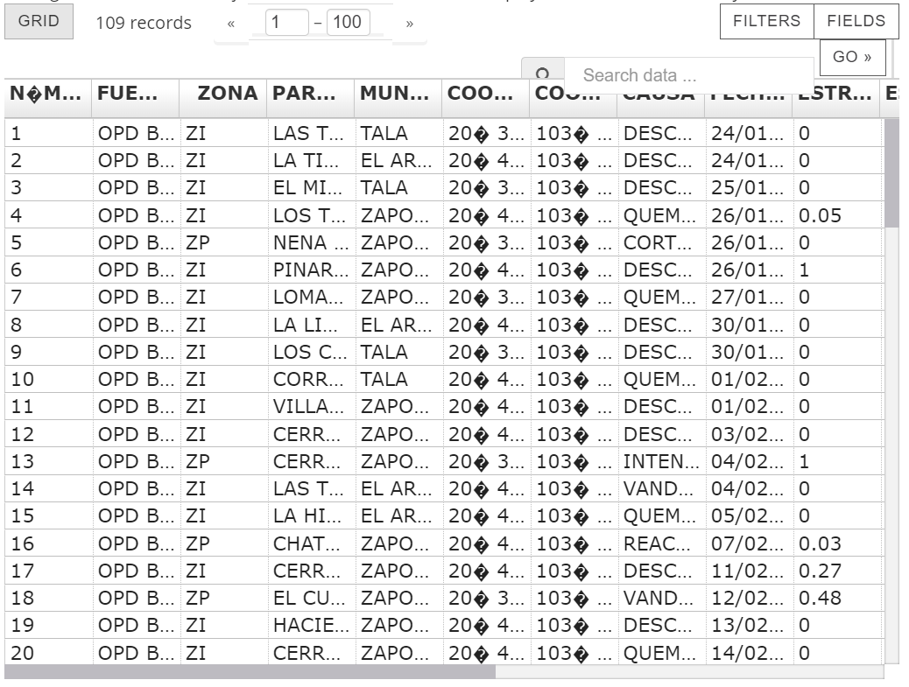

# Web Scraping and API consumption
## (By Daniel Herández Mota)

---
### The idea
The idea that I came up was to analyze the forest fires in the last year of the "Bosque de la primavera" in Jalisco, near Guadalajara. (Sad news: This is a recurring event yearly).

#### Some information:

According to the National System of Forest information, the leading cause of fires is because of human action, generating 90% of the cases. These fires are usually large and devastating, affecting not only the ecosystems but the resources. It is a problem that accounts for many economic and ecologic loss. 

One year ago, I developed an idea to approach this problem; however, it was only theoretically proposed. I didn't have data to work on, therefore, I thought that a good project could be to obtain the information with these new skills that I learned, to develop further the project.

(Data is needed to solve any problem)

---
### The approach
What I wanted to achieve was simple, I already had in mind the information that I needed to obtain, therefore I looked exactly for that in different databases.

I only focused on two sets of information:
- **Historical forest fire information**
- **Meteorological information** (meteorological information is imperative to determine the cause, direction, and strength of the forest fire)

The sources of information were:

1. [Datos Jalisco web page](https://datos.jalisco.gob.mx/search/type/dataset?query=incendio&sort_by=changed) for the historical forest fires.

2. [Dark Sky API](https://darksky.net/dev) for the meteorological info.

In a nutshell, Dark Sky API needs the latitude, longitude, and date to obtain the information, this was contained in the Datos Jalisco Web Page.

---
### The code 
#### General
The code was implemented in a Jupyter Notebook where the data scraping was done first to obtain key information and use that in the API. 

#### A detailed explanation
The libraries request, pandas, html5lib were imported, also BeautifulSoup and json_normalize from bs4 and pandas.io.json respectively. 

Firstly, WebScrapping was done.
The items that had the text 'Incendios forestales en Bosque La Primavera' also had a link that redirects to another page that had the information. 

I took all the information regarding the previous text and obtain their respective link. 

After this link was obtained, it was used to obtain another link that had the CSV files on them. I read the files with the same command of requests.get().content. 

At this point the data of all pages was in raw form in a mixture of CSV and HTML format (this due to BeautifulSoup), this was stored in a list. A Small clean was done so that all the data had the same number of rows, and then they were converted into pandas data frames. They were joined and exported as a CSV file named 'fire_data.csv'.

After this was done, the data cleaning was done: Some columns were renamed,  Unnecessary columns were dropped, a check for null values was done, a description of the dataset was done, some numerical data was changed. 

The most important information was carefully manipulated: latitude, longitude, and date because they had different formats. Latitude and longitude were as text in the GMS notation, GD was needed. Date was a string of dd/mm/yy, the value of Unix time was needed.

After doing this, the data was cleaned, some insights were determined and it was exported to a CSV called 'fire_data_clean.csv'

After this, the values of longitude, latitude, and date were used in the API (to access the API a key was needed, therefore registration was imperative and only 1000 requests per day could be done for free.).

The request to the API was done for all the forest fires in the other data frame. They were approximately 205 requests done. This generated a JSON file with the meteorological data; however, they had different information and therefore different lengths, so they couldn't be that easily merged.  
Ergo, to make easier the data manipulation, all the columns were compared to see which columns were the same for all the values. In total 29 columns were used.

With this, it was possible to generate a data frame with all the data. It was then exported to a file named 'metereological.csv'. 

Still, it was not clean. To clean this data, null values were changed, a refresh value was done, and the relevant information was preserved. The clean data was exported to a file named 'meteorological_clean.csv'.

At the end this both datasets were concatenated into a bigger data frame with all the wanted information. This was saved in a final CSV file named 'forest_fire_jalisco_data.csv'.

---
### Difficulties:

When trying to scrap the webpage, there were two options, the first one, in the 'Vista Previa' button showed a visualization of the data in a table. 

Nevertheless, the data that was shown couldn't be obtained with the methods that we learned of web scraping with the libraries requests and Beautifulsoup, therefore I try to obtain it with a different method. I went back again to the two options and obtain the direct link to the CSV that was in the option called 'descargar'.

It was possible to obtain all the data from that link without having to download the CSV. 

Data cleaning was also difficult to make for some data that didn't follow the same patterns that the other cases.

### Learnings:

Web scraping is a difficult task because there are many ways the webpages are structured. However, it can help to obtain information that otherwise would have been more difficult to obtain. 

New concepts were learned such as Unix time as a time measure and also that one can request a link that downloads some file and obtain the data from the file. That yields a great possibility to obtain data without having to download the contents!